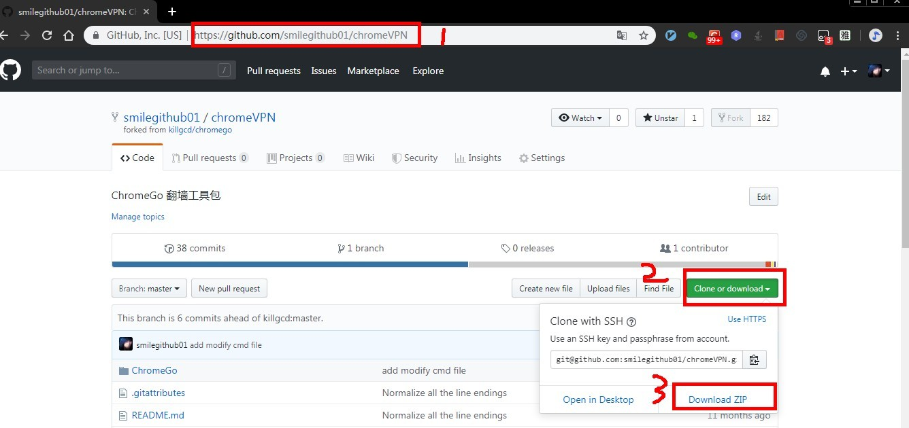

# chromeVPN
## ChromeVPN 翻墙工具包
  Windows<br>
 在ChromeGo的基础上增加了快捷启动和去掉了相关书签广告和设置默认打开页为Google<br>
<b>下载本项目</b><br>


<b>使用本软件</b><br>
请首先自行安装Google Chrome 浏览器，然后下载本软件，本软件会自动调用Google Chrome 浏览器翻墙。
下载本项目后，解压出来，请不要解压到含有中文或空格的目录路径，请不要不解压就直接从压缩包里运行！不解压会出错！ 
下载后，请认真阅读里面的使用帮助说明，然后  <b>0.xx-10.xx翻墙</b> 可依次尝试。<br>
进入目录 chromego-master\ChromeGo
执行start.bat,可以建立快捷方式到桌面以方便使用
命令行窗口显示如下
````
********************可供选择的VPN程序列表************************
0.trojan翻墙.cmd
1.Brook翻墙.cmd
2.蓝灯翻墙.cmd
3.Agent3翻墙.cmd
4.psiphon翻墙.cmd
5.Firefly翻墙.cmd
6.PAC翻墙.cmd
7.直连翻墙.cmd
8.ipv6-xxnet翻墙.cmd
9.Goflyway翻墙.cmd
_10.v2ray翻墙.cmd
********************请输入您选择的VPN程序序号********************
9
`````
注意：相关翻墙软件依赖Chrome,所以启动前会先kill chrome.exe进程，关闭Chrome浏览器，再重新打开</br>

<b>版权声明</b><br>
请随意分发，勿做商业使用。
